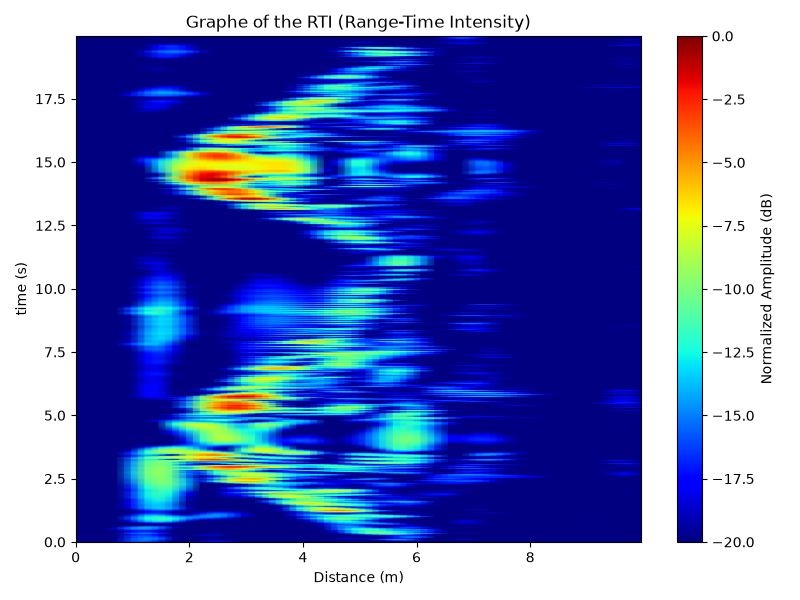

# Radar-System
Signal processing in Python for an educational FMCW &amp; SAR radar. 

---------------------

## Experimental Setup

The `.wav` data was acquired under real experimental conditions. To ensure strong radar cross-section (RCS) reflections, we used **metal plates** as moving targets placed in front of the radar's transmitting (TX) and receiving (RX) antennas. 

---

## Highlighted Result: Triangle Mode Analysis

### About the file: `acquistion_aller_retour_pause(2).wav`
This specific acquisition file captures a complex trajectory using triangular modulation** (alternating up-chirps and down-chirps). 
* **Data Structure:** The `.wav` file is stereo. Channel 0 contains the transmitted modulation ramps (Tx reference), and Channel 1 contains the received radar echo (Rx beat signal).
* **Physical Set up:** A metal plate was moved in front of the radar following a specific sequence:
  1. **Moving away:** The target's distance increases.
  2. **Pause:** The target stops moving, maintaining a constant distance.
  3. **Returning:** The target moves back towards the radar.

### Processing & Output
By processing this file with `traitement_triangle.py`, the algorithm separates the UP and DOWN ramps to decouple the Doppler shift from the range measurement. The resulting Range-Time Intensity (RTI) plot perfectly reflects the physical motion: you can visually track the target moving away and then come closer to the radar two times.

  

---

##  Installation and Usage

1. Clone this repository

2. **Install the required dependencies:**
```bash
pip install numpy scipy matplotlib
```

3. First run the `speed_mode.py` script and then the `main.py` script.

It's possible to use your own acquisition, make sure you use the same protocol and the same file format. More examples will be given soon.
